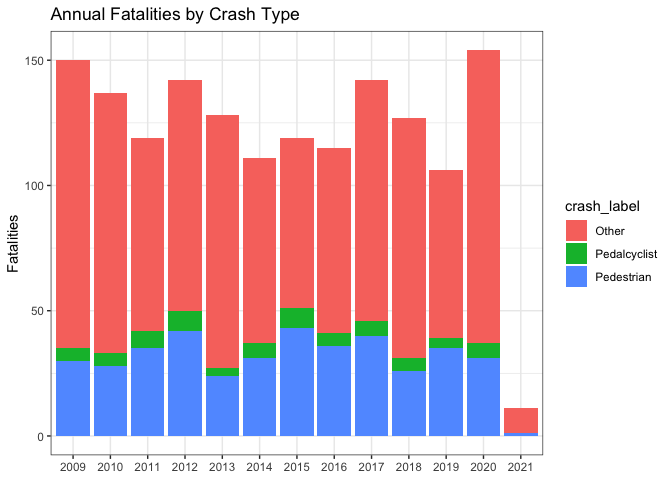
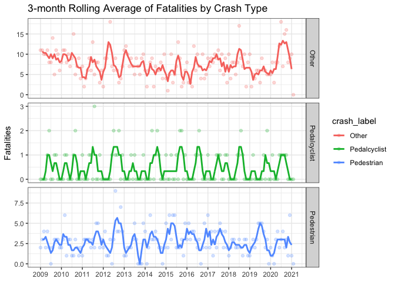
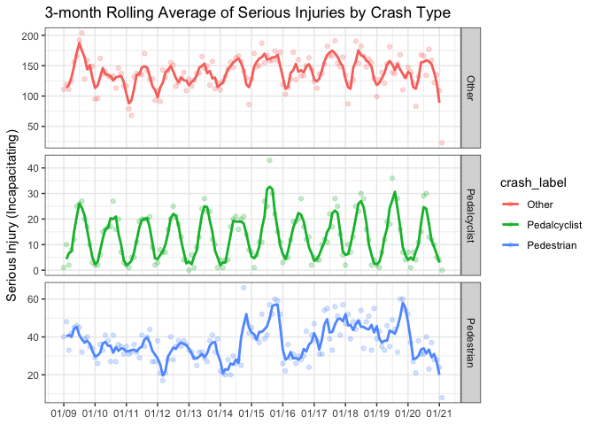

Chicago Crash Trends, 2009-present
================

## Time-series Crash Trends

These trends are based on crash data for Chicago since 2009. Pedestrian
and Cyclist (“Pedalcyclist” in crash reports) crashes are reported here,
along with all “other” crashes, which include injuries to auto
occupants.

### Crashes by Year, 2009-present

``` r
yearly = monthly_data %>%
  mutate(year = substr(monyr,1,4), crash_label = str_to_title(pedcyc)) %>%
  group_by(year, crash_label) %>%
  summarize(fatal = sum(fatal), serious_inj = sum(serious_inj), fatal_serious_inj = sum(fatal_serious_inj), any_inj = sum(any_inj), crashes = sum(crashes)) %>%
  arrange(year, desc(fatal)) %>%
  ungroup()

plot = ggplot(yearly, aes(x = year, y = fatal, group = crash_label)) + 
  geom_col(aes(fill = crash_label)) + 
  labs(title = "Annual Fatalities by Crash Type",x = NULL,y="Fatalities", color = "Crash Type") + theme_bw()

plot
```

<!-- -->

``` r
# Annual Fatalities by Crash Type
annual_cyc = yearly %>% 
  select(year,crash_label,fatal) %>%
  # filter(crash_label == "Pedalcyclist") %>%
  pivot_wider(names_from = crash_label, values_from = fatal) %>%
  mutate(
    # % change all fatalities
    total = Other + Pedestrian + Pedalcyclist,
    total_diff = total - (lag(Other) + lag(Pedestrian) + lag(Pedalcyclist)),
    total_chg = ifelse(!year %in% c(2009, format(Sys.Date(), "%Y")),paste(format(round((total_diff / total) * 100, 1), nsmall=0, big.mark=","), "%", sep=""),NA),
    
    # % change cyclist fatalities
    active = Pedestrian + Pedalcyclist,
    active_diff = (Pedestrian + Pedalcyclist) - (lag(Pedestrian) + lag(Pedalcyclist)),
    active_chg = ifelse(!year %in% c(2009, format(Sys.Date(), "%Y")),paste(format(round((active_diff / active) * 100, 1), nsmall=0, big.mark=","), "%", sep=""),NA)
         )

kable(annual_cyc,
      align = rep("r",10),
      col.names = c("Year",
                    "Auto",
                    "Pedestrian",
                    "Cyclist",
                    "Total",
                    "$\\Delta$ Total",
                    "% Change",
                    "Ped + Cyc",
                    "$\\Delta$ Ped + Cyc",
                    "% Change"),
      caption = "Annual Fatalities by Crash Type")
```

| Year | Auto | Pedestrian | Cyclist | Total | \(\Delta\) Total | % Change | Ped + Cyc | \(\Delta\) Ped + Cyc | % Change |
| ---: | ---: | ---------: | ------: | ----: | ---------------: | -------: | --------: | -------------------: | -------: |
| 2009 |  115 |         30 |       5 |   150 |               NA |       NA |        35 |                   NA |       NA |
| 2010 |  104 |         28 |       5 |   137 |             \-13 |   \-9.5% |        33 |                  \-2 |   \-6.1% |
| 2011 |   77 |         35 |       7 |   119 |             \-18 |  \-15.1% |        42 |                    9 |    21.4% |
| 2012 |   92 |         42 |       8 |   142 |               23 |    16.2% |        50 |                    8 |    16.0% |
| 2013 |  101 |         24 |       3 |   128 |             \-14 |  \-10.9% |        27 |                 \-23 |  \-85.2% |
| 2014 |   74 |         31 |       6 |   111 |             \-17 |  \-15.3% |        37 |                   10 |    27.0% |
| 2015 |   68 |         43 |       8 |   119 |                8 |     6.7% |        51 |                   14 |    27.5% |
| 2016 |   74 |         36 |       5 |   115 |              \-4 |   \-3.5% |        41 |                 \-10 |  \-24.4% |
| 2017 |   96 |         40 |       6 |   142 |               27 |    19.0% |        46 |                    5 |    10.9% |
| 2018 |   96 |         26 |       5 |   127 |             \-15 |  \-11.8% |        31 |                 \-15 |  \-48.4% |
| 2019 |   67 |         35 |       4 |   106 |             \-21 |  \-19.8% |        39 |                    8 |    20.5% |
| 2020 |  117 |         31 |       6 |   154 |               48 |    31.2% |        37 |                  \-2 |   \-5.4% |
| 2021 |   10 |          1 |       0 |    11 |            \-143 |       NA |         1 |                 \-36 |       NA |

Annual Fatalities by Crash Type

### Crashes by Month, 2009-present

If we look at crashes in monthly slices, we can identify seasonal
trends, months with most and least fatalities and serious injuries, and
what the “average” month looks like. This can help us assess progress
toward Vision Zero goals or particularly bad months for people walking
and biking.

These data are very noisy, jumping around from month to month with few
clear trends, so I’ve added a 3-month rolling average (darker line) to
the following plots of monthly data. The actual counts are represented
by lighter dots.

``` r
# Worst month of Fatalities by Crash Type
table1 = monthly_data %>% group_by(pedcyc) %>% filter(fatal == max(fatal))
kable(table1, caption = "Months with Most Fatalities by Crash Type")
```

| monyr   | pedcyc       | fatal | serious\_inj | fatal\_serious\_inj | any\_inj | crashes |
| :------ | :----------- | ----: | -----------: | ------------------: | -------: | ------: |
| 2011-08 | PEDALCYCLIST |     3 |           20 |                  23 |      202 |     216 |
| 2012-05 | other        |    18 |          142 |                 160 |     1492 |    6589 |
| 2012-08 | PEDESTRIAN   |     9 |           35 |                  44 |      228 |     224 |
| 2020-07 | other        |    18 |          166 |                 184 |     1817 |    8591 |

Months with Most Fatalities by Crash Type

``` r
# Worst month of Serious Injuries by Crash Type
table2 = monthly_data %>% group_by(pedcyc) %>% filter(serious_inj == max(serious_inj))
kable(table2, caption = "Months with Most Serious Injuries by Crash Type")
```

| monyr   | pedcyc       | fatal | serious\_inj | fatal\_serious\_inj | any\_inj | crashes |
| :------ | :----------- | ----: | -----------: | ------------------: | -------: | ------: |
| 2009-08 | other        |    14 |          204 |                 218 |     1654 |    6497 |
| 2014-10 | PEDESTRIAN   |     2 |           66 |                  68 |      279 |     269 |
| 2015-08 | PEDALCYCLIST |     0 |           43 |                  43 |      268 |     274 |

Months with Most Serious Injuries by Crash Type

``` r
monthly = monthly_data %>%
  group_by(pedcyc) %>%
  mutate(date = base::as.Date(paste0(monyr,"-01"), format = "%Y-%m-%d")) %>%
  mutate(crash_label = str_to_title(pedcyc)) %>%
  mutate(fatal_3mo = zoo::rollmean(fatal, k = 3, fill = NA), seriousinj_3mo = zoo::rollmean(serious_inj, k = 3, fill = NA))
  
#plot = ggplot(monthly) + geom_area(aes(monyr, fatal, group = pedcyc, color = pedcyc, fill = pedcyc)) + geom_line(aes(monyr, fatal_3mo, group = pedcyc, color = pedcyc))

plot = ggplot(monthly) + geom_point(aes(date,fatal, color = crash_label), alpha = 0.25) + geom_line(aes(date, fatal_3mo, group = crash_label, color = crash_label), size = 1) + labs(title = "3-month Rolling Average of Fatalities by Crash Type",x = NULL,y="Fatalities") + scale_x_date(date_labels = "%Y", date_breaks = "1 year") + theme_bw() + facet_grid(crash_label ~ ., scales="free_y")

plot
```

<!-- -->

``` r
plot2 = ggplot(monthly) + geom_point(aes(date,serious_inj, color = crash_label), alpha = 0.25) + geom_line(aes(date, seriousinj_3mo, group = crash_label, color = crash_label), size = 1) + labs(title = "3-month Rolling Average of Serious Injuries by Crash Type",x = NULL,y="Serious Injury (Incapacitating)") + scale_x_date(date_labels = "%m/%y", date_breaks = "1 year") + theme_bw() + facet_grid(crash_label ~ ., scales="free_y")

plot2
```

<!-- -->

I want to look at the summer of 2016, which felt like a particularly bad
time to be a cyclist in Chicago. That summer saw a string of young women
and non-binary bicyclists struck and killed, particularly by large
trucks. What I felt that summer does not appear as an outlier in this
data, however. It may be a reflection that media coverage of these
crashes was more intense than usual because Virginia Murray was the
first U.S. death on a bikeshare (Divvy) bike and the string of young
(and white) people killed that summer became a trend story: what’s going
on with all these cyclist deaths? But if you go strictly by the data, it
isn’t out of the ordinary to have 1 or 2 bike fatalities in a summer
month in Chicago. The question is whether we’ve ignored similar trends
because other deaths were ignored or if monthly data hides particularly
bad summers. My hunch is it’s the former.

``` r
table_summer16 = monthly_data %>% filter(pedcyc == "PEDALCYCLIST", monyr %in% c("2016-05","2016-06","2016-07","2016-08","2016-09"))
kable(table_summer16, caption = "Summer 2016 Cyclist Crashes")
```

| monyr   | pedcyc       | fatal | serious\_inj | fatal\_serious\_inj | any\_inj | crashes |
| :------ | :----------- | ----: | -----------: | ------------------: | -------: | ------: |
| 2016-05 | PEDALCYCLIST |     0 |           19 |                  19 |      140 |     150 |
| 2016-06 | PEDALCYCLIST |     1 |           19 |                  20 |      224 |     228 |
| 2016-07 | PEDALCYCLIST |     1 |           20 |                  21 |      222 |     232 |
| 2016-08 | PEDALCYCLIST |     2 |           28 |                  30 |      229 |     245 |
| 2016-09 | PEDALCYCLIST |     1 |           17 |                  18 |      215 |     223 |

Summer 2016 Cyclist Crashes

In June 2016, [Blaine
Klingenberg](https://www.chicagoreader.com/chicago/klingenberg-fatal-crash-red-light-witness-reports/Content?oid=22678194)
was struck and killed by a tour bus driver at Michigan and Oak.

In July, [Virginia
Murray](https://chi.streetsblog.org/2016/07/01/police-divvy-rider-critically-injured-at-belmont-and-sacramento/)
was killed by a right-turning truck driver at Belmont and Scramento.

In August, [Lisa
Kuivinen](https://chi.streetsblog.org/2016/08/16/lisa-kuivinen-20-struck-and-killed-while-biking-on-milwaukee-avenue/)
was killed by a truck driver on Milwaukee Avenue, which has protected
bike lanes. [Francisco
Cruz](https://chi.streetsblog.org/2016/08/19/cyclist-francisco-cruz-remembered-as-a-good-samaritan-driver-still-at-large/)
was killed by a hit-and-run driver.

Then in September, [Anastasia
Kondrasheva](https://chi.streetsblog.org/2016/09/27/woman-killed-in-yesterdays-biketruck-crash-identified-as-anastasia-kondrasheva-23/)
was killed by a right-turning truck driver at Addison and Damen.
